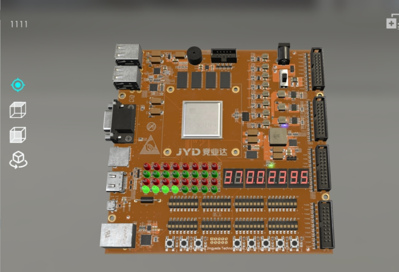

基于rv32i指令集架构实现的五级流水线CPU
==========

环境
--------
-**语言**：systemverilog  
-**软件**：vivado23.2  
-**板子**：竞业达开发板，采用kintex-7 系列XC7K325T芯片  
-**测试**：竞业达官方测试指令irom.coe,dram.coe  

### 运行
首先将这个项目放到纯英文路径下，   
然后请确保您的电脑上有vivado23.2，用vivado打开这个项目  
该项目下的\digital_twin\digital_twin.srcs\保存着设计代码  
生成的比特流文件在\digital_twin\digital_twin.runs\impl_1\top.bit中，  

您可以将您的vivado连接上板子来将该比特流文件烧录到板子上测试。  
或者您也可以用您的vivado来重新综合，实现，生成比特流文件来验证  
测试用例用的是竞业达官方给的irom.coe和dram.coe，在\digital_twin\digital_twin.srcs\sources_1\imports\test_src\目录下  
如果您打算重新综合，实现，请在项目中找到IROM核和DRAM核，重新将您当前路径下的test_src\目录下的coe文件烧录进去  
然后您连接到板子进行测试，可以看到led灯显示过了rv32i的37条基础指令集  

### 如图

